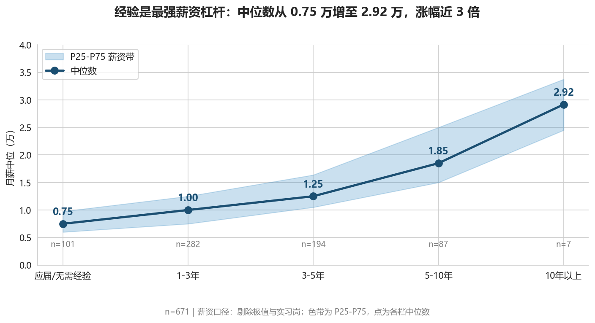
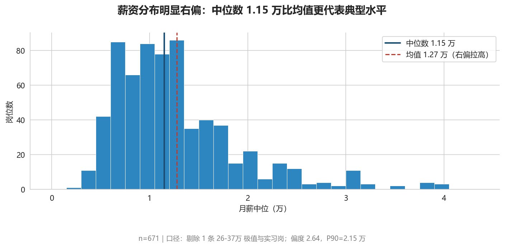
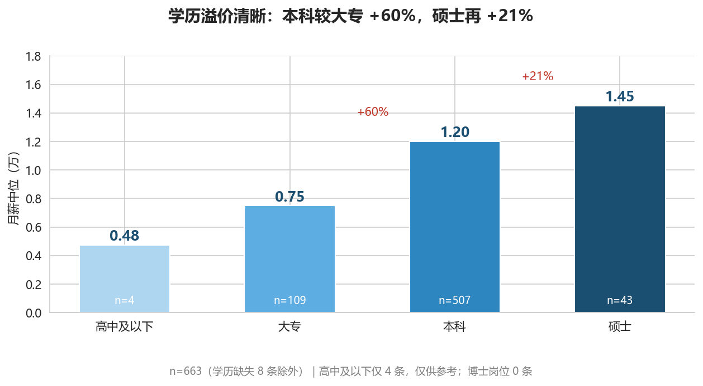
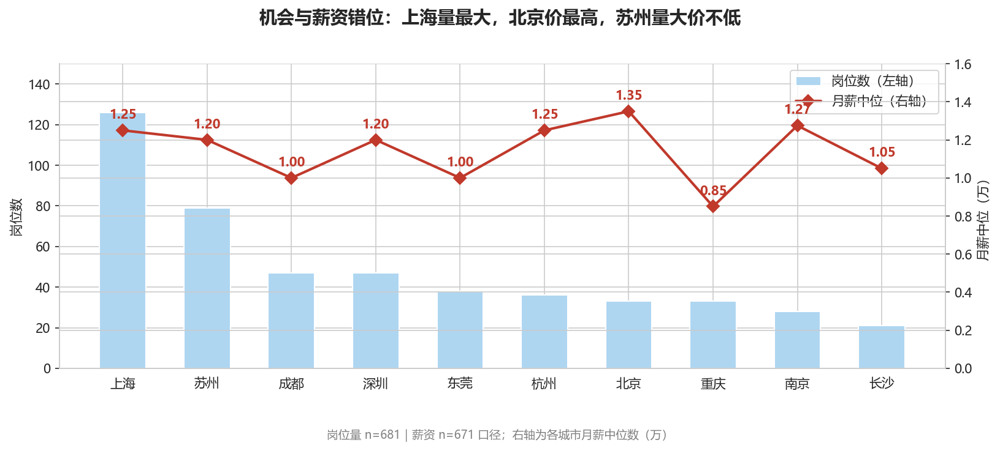
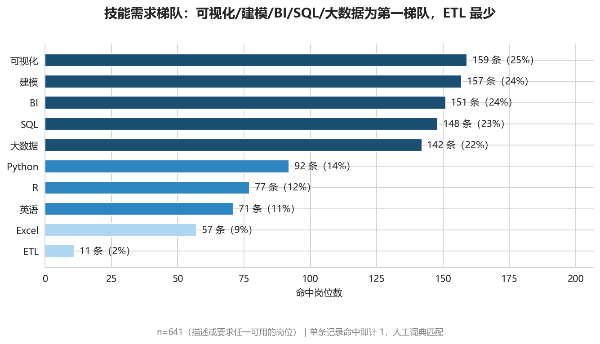
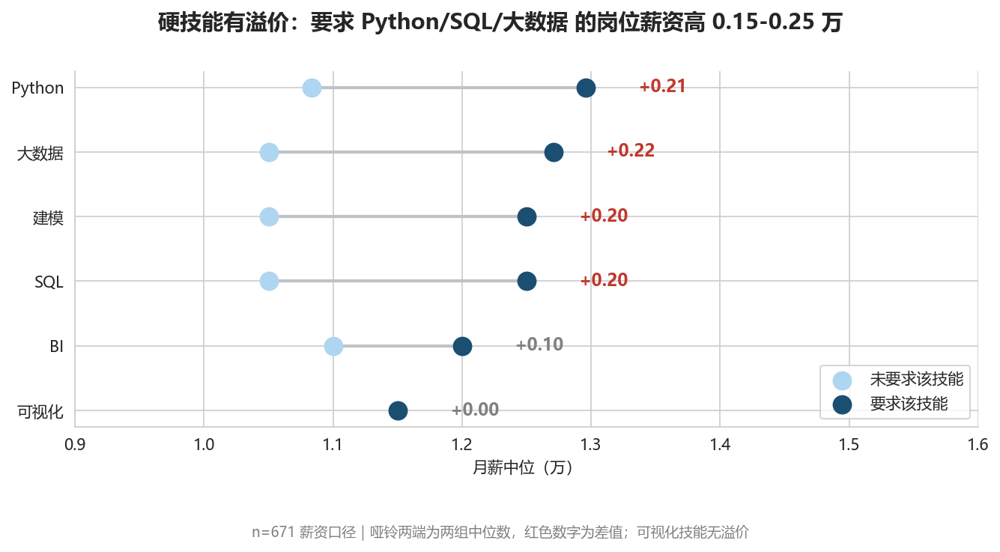
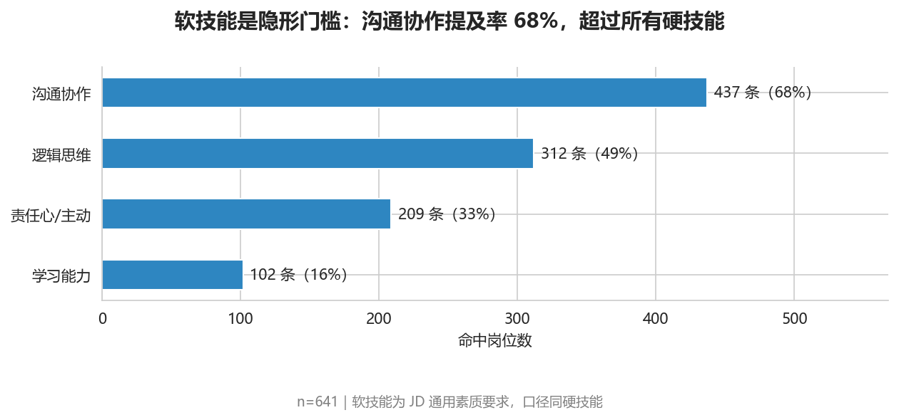
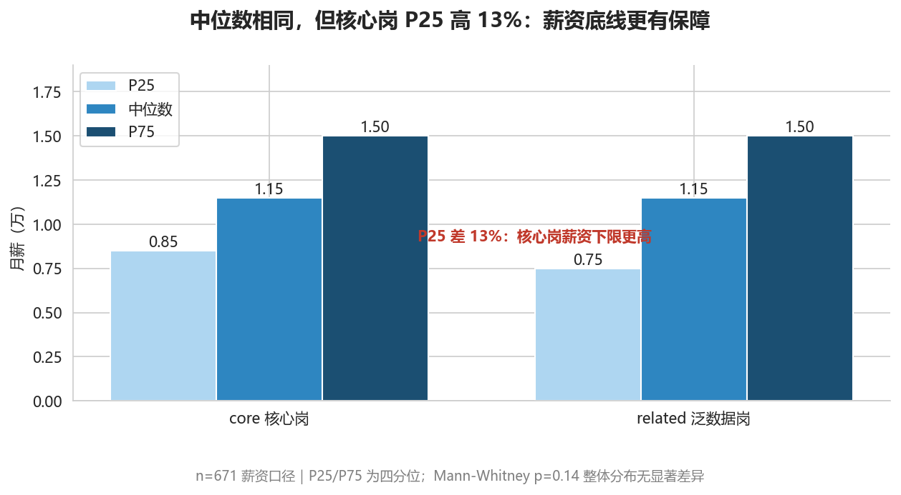

# 数据分析师岗位招聘市场画像分析

> **项目声明**：本项目为个人学习作品（求职面试用作品集），非商业用途；数据来自公开招聘页面，仅用于技术研究与分析练习，不代表任何机构立场，如有侵权或不当之处请联系删除。
>
> 基于前程无忧（51job）26 个城市 681 条在架岗位数据，从城市、薪资、技能、企业四个维度刻画 2026 年数据分析岗招聘市场画像。
> 采集窗口：2026-07（爬取时点仍在架的岗位）；薪资口径：中位数 + P25/P75（n=671）。



## 核心结论一览

| # | 结论 | 关键数字 |
|---|---|---|
| 1 | 数据分析岗月薪中位 1.15 万，分布右偏，全项目以中位数为准 | n=671，偏度 2.64 |
| 2 | 经验是最强薪资杠杆 | 应届 0.75 万 → 10 年以上 2.92 万，近 3 倍 |
| 3 | 学历溢价清晰，本科是绝对主力 | 本科较大专 +60%，硕士再 +21%；本科占 76% |
| 4 | 城市「量价错位」，新一线贡献过半需求 | 上海量最大（18%），北京价最高（1.35 万），新一线占 55% |
| 5 | 硬技能有溢价，软技能是隐形门槛 | Python/SQL/大数据 溢价 0.15-0.25 万；沟通协作提及率 68% |
| 6 | 核心岗与泛数据岗定价无显著差异 | Mann-Whitney p=0.14；但核心岗 P25 高 13% |

## 分析结论与图表

### 1. 薪资：右偏分布，中位数比均值更可靠

薪资均值 1.27 万被高薪长尾拉高，中位数 1.15 万更能代表典型水平。验证过程：剔除 1 条 26-37万 极值后，均值变动 3.4%，中位数纹丝不动——右偏分布下均值对单条数据过敏。



### 2. 经验：最强薪资杠杆

中位数从应届/无需经验的 0.75 万增至 10 年以上的 2.92 万，涨幅近 3 倍；色带（P25-P75）随经验同步走宽，资深岗分化更大。（图 3-2 见首屏）

### 3. 学历：本科是分水岭

本科中位 1.20 万，较大专（0.75 万）高 60%；硕士 1.45 万，再溢价 21%。本科岗位占 76%，是市场的绝对主力。



### 4. 城市：机会与薪资错位

岗位量 Top1 是上海（126 条，占 18%），但薪资最高是北京（1.35 万）；苏州量大价不低（79 条 / 1.20 万）。新一线城市合计贡献 55.8% 的需求，超过一线与二线之和。



### 5. 技能：硬技能溢价，软技能兜底

BI 工具（151 条）与 SQL（148 条）并驾齐驱；要求 Python/SQL/大数据的岗位薪资高 0.15-0.25 万。可视化技能已无溢价（+0.00）——它从加分项变成了基础素养。软技能中沟通协作提及率 68%，超过所有硬技能。





### 6. 核心岗 vs 泛数据岗：名称不等于要求

两类岗位薪资分布无显著差异（Mann-Whitney p=0.14），经验结构也几乎一致（1-5 年经验均占约 70%）。唯一差别：核心岗 P25 高 13%，薪资下限更有保障。**求职建议：别看岗位 title，看 JD 里的技能要求。**



## 项目亮点（方法论）

- **口径验证先行**：每个分析维度开头先做口径验证，用数据证明统计方法合理（如中位数三连证：偏度检验 → 极值敏感度实验 → 定口径），再进入主分析
- **词典完备性验证**：技能提取用人工词典 + 正则词边界（避免 jieba 切碎英文缩写），再用「词典外高频词扫描」兜底——Tableau/PowerBI 就是扫描发现后补入的，BI 命中从 85 修正到 151
- **结论式标题 + 数据回核**：每张图标题是一句结论，n 和口径统一放脚注；标题中每个数字都能在图上指出
- **阴性结果如实呈现**：核心岗对比无显著差异（p=0.14），如实报告并给出解释，不硬凑差异
- **全流程可复现**：`run_all.py` 一键从原始数据重建终表；质检双报告（quality_report.md）记录两轮质检与六项终检

## 数据说明

| 项 | 说明 |
|---|---|
| 来源 | 前程无忧（51job）公开招聘页面，仅供学习研究 |
| 采集窗口 | 2026-07，爬取时点仍在架的岗位（非市场招聘量趋势） |
| 范围 | 26 个城市（一线 4 + 新一线 14 + 二线 8），关键词「数据分析」 |
| 数据量 | 原始 1495 条 → 去重 1270 条 → 终表 681 条 × 29 列（core 313 + related 368） |
| 新鲜度 | 在架岗位以 2026 年 6-7 月发布为主 |
| 薪资口径 | 月薪中位（万），剔除 1 条 26-37万 极值与实习岗，n=671 |

## 目录结构

```
data-analyst-job-analysis/
├── spiders/            # 爬虫：列表页 + 详情页（断点续传/熔断/原子写入）
├── src/                # 6 步清洗管线 + run_all.py 一键复现
├── notebooks/          # 6 个分析文件（01 总览 ~ 06 核心岗对比）
├── docs/
│   ├── charts/         # 25 张分析图表（PNG）
│   ├── aggregates/     # 聚合数据表（CSV）
│   ├── logs/           # 开发日志
│   ├── quality_report.md      # 质检报告
│   └── visualization_plan.md  # 可视化方案
└── data/               # 数据文件（不上传 git）
```

## 复现

```bash
pip install -r requirements.txt
python src/run_all.py        # 数据管线一键复现
# 然后按编号顺序运行 notebooks/ 下的分析文件
```

## 开发记录

- [开发日志](docs/logs/)：2026-07-24 ~ 2026-08-14，逐日记录
- [质检报告](docs/quality_report.md)：两轮质检 + 六项终检
- [可视化方案](docs/visualization_plan.md)：6 大主题 25 图的设计与口径规则
- [分析报告](docs/analysis_report.md)：完整分析结论与建议
