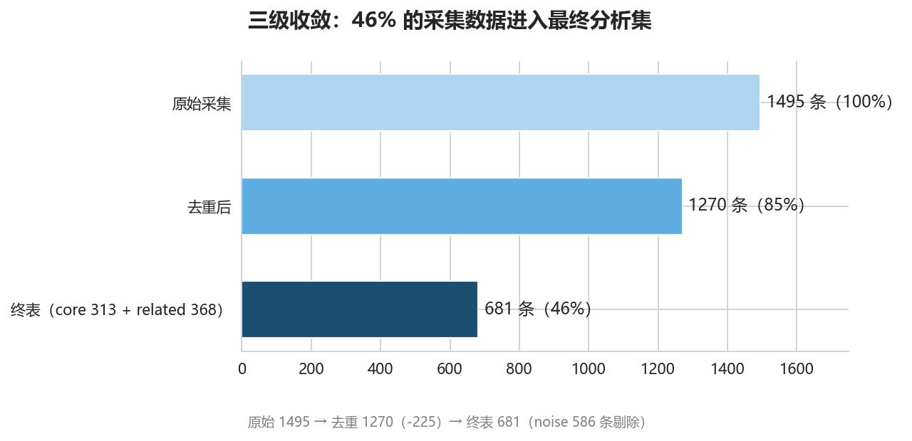
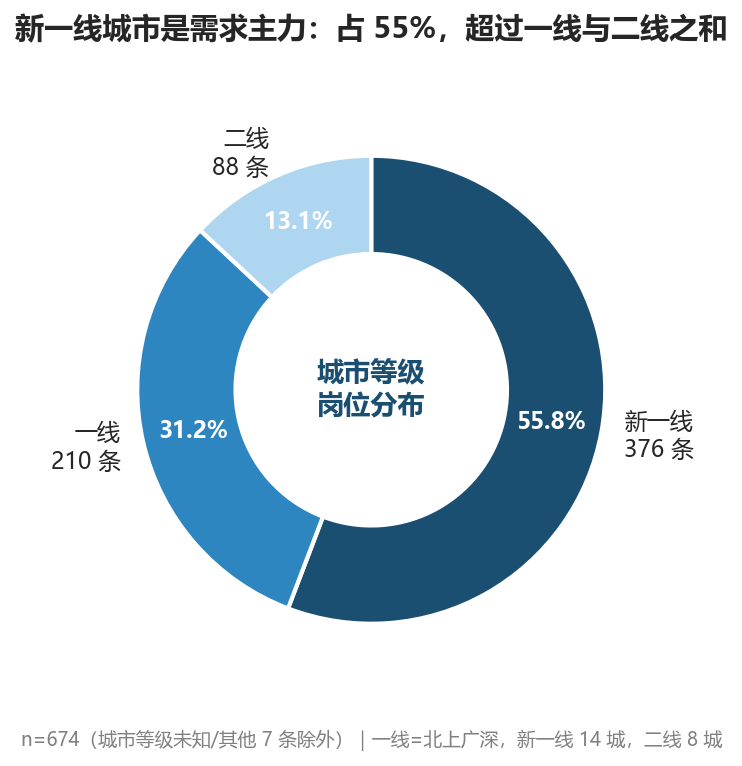
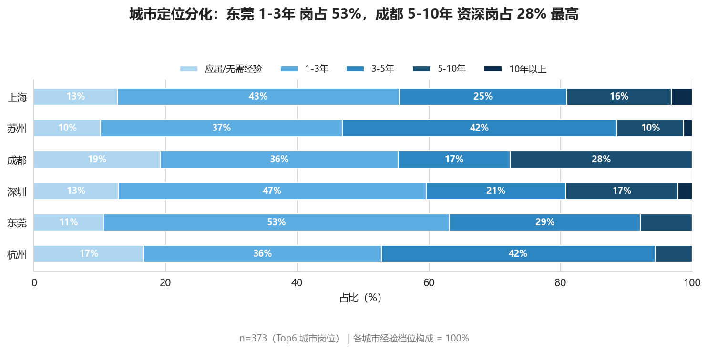
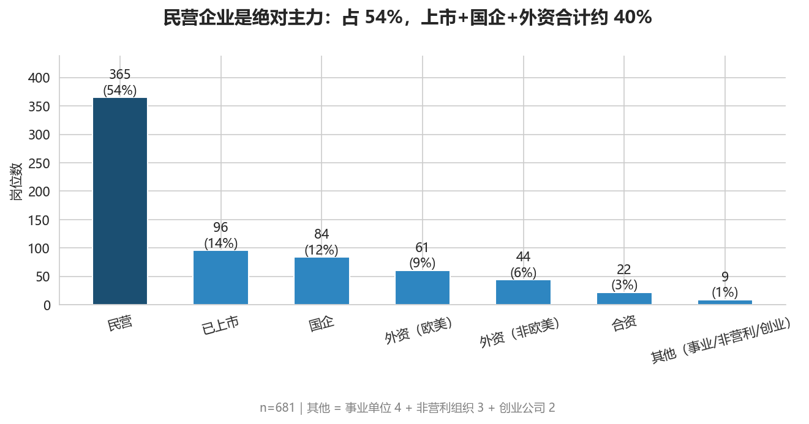
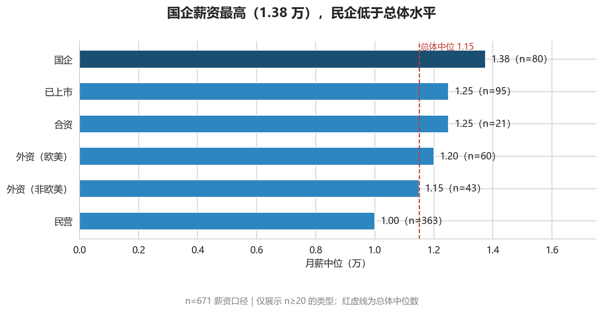

# 数据分析岗招聘市场分析报告

> 个人学习项目（求职作品集），非商业用途。数据来自公开招聘页面，仅用于技术研究与分析练习。

## 一、项目背景

想搞清楚一个问题：2026 年的数据分析岗，市场到底要什么样的人？

拆成四个可回答的子问题：哪些城市需求最旺？经验和学历各自值多少钱？企业 JD 里最常出现哪些技能？名字里带「数据分析」的核心岗和泛数据岗，定价有没有差别？

数据自己动手采：前程无忧 26 个城市、关键词「数据分析」，2026 年 7 月采集，拿到的都是爬取时点仍在架的岗位。原始 1495 条，清洗后 681 条进入分析。

## 二、数据与口径

### 2.1 数据漏斗

1495（原始采集）→ 1270（去重）→ **681（终表：core 313 + related 368）**

去重掉的 225 条里大部分是「同公司同岗位在多城市搜索组重复出现」；终表前又剔除了 586 条噪音岗（标题带数据分析但实际是销售/运营助理等）。每一步都有代码可复现，详见 `src/`。

### 2.2 口径声明（先说清楚再分析）

| 口径 | 规则 | 原因 |
|---|---|---|
| 薪资统计 | 一律中位数 + P25/P75，不用均值 | 分布右偏（偏度 2.64），均值被长尾拉高 |
| 极值 | 1 条 26-37万 记录全局剔除并在图脚注声明 | 单条极值能拉动均值 3.4%，中位数不受影响 |
| 实习岗 | is_intern=1 的 4 条不进薪资统计 | 实习定价逻辑与正式岗不同 |
| 薪资样本 | 有效 n=671（终表 681 中剔除极值、实习、缺失） | — |
| 文本分析 | 以有值样本为口径：描述 635 / 要求 531 / 福利 522 | 部分详情页采集失败，缺失已在质检报告登记 |
| 样本性质 | 在架岗位画像，**不代表市场招聘量趋势** | 发布时间分布反映的是平台的在架周期 |

关于中位数口径，做过一个敏感度实验：把那一条 31.5 万的记录拿掉，均值从 1.32 掉到 1.275（动了 3.4%），中位数 1.15 一动不动。右偏分布里均值对单条数据过敏，所以全项目结论只认中位数。

## 三、分析发现

### 3.1 城市：机会和薪资是错位的

岗位量 Top1 是上海（126 条，占 18%），但薪资最高是北京（中位 1.35 万）；苏州量大价不低（79 条 / 1.20 万）是性价比之选。按城市等级看，新一线 14 城合计贡献 55.8% 的需求，超过一线和二线之和——数据分析岗的需求重心已经不在传统一线了。

城市之间的岗位结构也有分化：东莞 53% 的岗位要求 1-3 年经验（初级岗密集），成都 5-10 年资深岗占 28% 为各城最高。

### 3.2 薪资：经验是最强杠杆

整体月薪中位 1.15 万（n=671），P25-P75 为 0.80-1.50 万。分布明显右偏，少数高薪岗把尾巴拉得很长。

经验维度的溢价非常陡：应届 0.75 万 → 1-3 年 1.00 万 → 3-5 年 1.25 万 → 5-10 年 1.85 万 → 10 年以上 2.92 万，跨度近 3 倍。同时 P25-P75 色带随经验走宽——越资深，谈薪空间越大，分化越明显。

### 3.3 学历：本科是分水岭

大专 0.75 万 → 本科 1.20 万（+60%）→ 硕士 1.45 万（再 +21%）。本科岗位占 76%，是市场的绝对主力；博士岗位为 0——这类研究型需求不走普通招聘渠道。注意高中及以下只有 4 条，仅展示不下结论。

### 3.4 技能：硬技能溢价，软技能兜底

技能提取没有用 jieba 分词（它会把 SQL、Excel 这类英文缩写切碎），而是人工词典 + 正则词边界匹配。词典定稿后还做了一次「词典外高频词扫描」验证完备性——正是这一步发现企业更爱写具体工具名，把 Tableau / PowerBI / FineBI 补入后，BI 命中从 85 修正到 151。

第一梯队：可视化 159、建模 157、BI 151、SQL 148、大数据 142。ETL 只有 11 条，和直觉相反——企业把数据准备的工作默认包含在「SQL/大数据」里了。

要求 Python / SQL / 大数据的岗位，薪资中位高 0.15-0.25 万；而可视化没有溢价（+0.00）——它不是加分项，是基础门槛，没有它才是问题。

软技能是隐藏的大头：沟通协作提及率 68%，超过所有硬技能；逻辑思维 49%。JD 里的原话高频出现「能把分析结论讲清楚」「跨部门推动」——数据分析岗的产出是决策支持，不是报表本身。

### 3.5 企业：民企是主力，国企价最高

民营企业占 54%（365 条），是绝对需求主力；上市 + 国企 + 外资合计约 40%。

薪资排序出乎意料：国企最高（1.38 万），已上市和合资并列 1.25 万，民企 1.00 万反而低于总体中位。民企量大价平，国企量少价高。（仅展示 n≥20 的类型）

福利侧：五险一金覆盖率 83%，年终奖、带薪年假是第二梯队。

### 3.6 核心岗 vs 泛数据岗：名称不等于要求

这是项目里最有意思的一个「阴性结果」。事前假设是核心岗（标题明确为数据分析）定价更高，实际数据：

两组中位数都是 1.15 万，Mann-Whitney U 检验 p=0.14，分布无显著差异；经验结构也几乎一致（1-5 年经验均占约 70%）。唯一可辨的差异是核心岗 P25 高 13%（0.85 vs 0.75）——下限更有保障，天花板相同。

结论：招聘市场上岗位 title 的信号价值很低，求职时应该看 JD 里的技能要求，而不是岗位名称。

## 四、结论与建议

**给求职者（应届/初级）：**

1. 城市选择上不必死磕一线：新一线贡献 55% 需求，苏州、成都这类城市机会密集且生活成本低
2. 技能优先级：SQL 和可视化是门票（没有会被刷），Python / 大数据是溢价项（有了多拿 0.15-0.25 万）
3. 软技能别当口号：68% 的 JD 要求沟通协作，简历里要有「向非技术方讲清分析结论」的具体事例
4. 前 3 年是薪资爬坡最快的阶段（0.75 → 1.25 万），跳槽涨薪窗口在 3-5 年经验段

**给培养方（高校/自学者）：**

课程体系里 SQL + 统计学 + 可视化是基础盘；BI 工具（Tableau/PowerBI）企业需求明确但教学覆盖少，是性价比很高的补充；建模能力宜结合业务案例教，单讲算法对不上 JD 里的「建模」语境。

## 五、局限性

1. **在架口径**：数据是 2026-07 爬取时点仍在架的岗位，反映「此时市场上挂着什么」，不等于招聘量趋势，也无法观察季节波动
2. **文本缺失偏斜**：组4/组5 部分详情页采集失败，文本类分析样本偏向组1-3（已在质检报告登记，相关结论以有值样本为口径）
3. **薪资为标价非成交价**：JD 标注薪资是企业挂牌价，和实际 offer 存在系统性差距，本报告所有薪资结论应理解为「市场定价水平」
4. **技能词典人工定义**：虽经高频词扫描验证完备性，仍可能漏掉长尾技能词；命中率是「提及率」，不等于要求深度
5. **单平台单关键词**：仅 51job、仅「数据分析」关键词，商业分析、数据运营等相关岗位未覆盖

## 六、附录

- 复现：`pip install -r requirements.txt` → `python src/run_all.py` → 按编号运行 `notebooks/`
- 全部图表：`docs/charts/`（22 张）；聚合数据：`docs/aggregates/`
- 过程文档：[可视化方案](visualization_plan.md)（含实施校准）、[质检报告](quality_report.md)、[开发日志](logs/)
